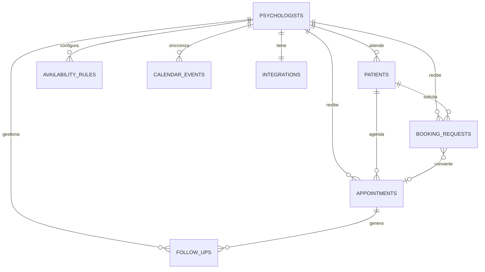

# Actividad Final DatAI - Serene en Supabase

## 1. Problema

Serene es una plataforma pensada para psicologos independientes y pequenos consultorios de salud mental. El problema principal es que muchos profesionales pierden tiempo coordinando citas, revisando disponibilidad, enviando recordatorios y evitando cruces con su calendario personal. Esa friccion administrativa afecta la experiencia del paciente y tambien puede producir cancelaciones, no-shows y perdida de ingresos.

La base de datos propuesta permite centralizar psicologos, pacientes, reglas de disponibilidad, citas, solicitudes de reserva, integraciones y seguimientos. El objetivo no es solo guardar datos, sino responder preguntas de negocio: ocupacion de agenda, conversion por canal, riesgo de no-show, pacientes recurrentes y carga operativa.

## 2. Plataforma elegida

La plataforma elegida fue **Supabase PostgreSQL**, una plataforma cloud/serverless del catalogo del curso. Se eligio porque el caso de Serene es principalmente relacional: un psicologo tiene muchos pacientes, muchas citas, muchas reglas de disponibilidad y muchos eventos de calendario. PostgreSQL permite modelar estas relaciones con llaves foraneas, restricciones, indices y consultas analiticas.

Tambien se considero **MongoDB Atlas** y **BigQuery**. MongoDB Atlas es util cuando el esquema es muy flexible, pero en este caso las relaciones y reglas de integridad son importantes. BigQuery es muy fuerte para analitica a gran escala, pero para una aplicacion transaccional de reservas seria menos practico como base principal. Supabase ofrece un punto intermedio: base transaccional real, consultas SQL potentes, interfaz web, tier gratuito y facil verificacion por el profesor.

## 3. Modelo de datos

El modelo incluye las siguientes entidades:

- `psychologists`: profesionales registrados en Serene.
- `patients`: pacientes asociados a cada psicologo.
- `availability_rules`: horarios de atencion semanales.
- `calendar_events`: bloques ocupados importados desde Google Calendar.
- `appointments`: citas confirmadas, completadas, canceladas o no-show.
- `booking_requests`: solicitudes de reserva por web, WhatsApp, email o canal manual.
- `follow_ups`: acciones de seguimiento clinico despues de una cita.
- `integrations`: estado de Google Calendar, WhatsApp y email.

## 4. Datos cargados

Se cargaron datos sinteticos para simular una operacion realista:

- 8 psicologos.
- 240 pacientes.
- 42 reglas de disponibilidad.
- 160 eventos ocupados de calendario.
- 900 citas.
- 320 solicitudes de reserva.
- 180 seguimientos.

Los datos sinteticos permiten probar consultas de negocio sin usar informacion personal real de terceros, cumpliendo la regla de privacidad de la actividad.

## 5. Consultas de negocio

El archivo `02_business_queries.sql` contiene consultas significativas. Algunas preguntas respondidas son:

1. Que psicologos tienen mejores indicadores de finalizacion y no-show?
2. Que porcentaje de ocupacion tiene cada agenda semanal?
3. Que horarios y canales generan mas solicitudes?
4. Que pacientes son recurrentes y tienen mejor NPS?
5. Que canal convierte mejor solicitudes en citas reales?
6. Que profesionales tienen mayor riesgo operativo por cancelaciones y no-shows?
7. Existen conflictos entre citas y bloques ocupados de Google Calendar?
8. Que seguimientos clinicos estan pendientes?

Las consultas usan joins, agregaciones, CTEs, filtros, vistas y una window function (`dense_rank`) para ranking de riesgo.

## 6. Que fue practico y que costo

Lo mas practico de Supabase fue poder crear una base PostgreSQL desde el navegador y ejecutar scripts SQL completos sin instalar infraestructura local. Tambien fue facil estructurar el modelo con llaves foraneas e indices, lo cual ayuda a explicar el diseno.

Lo que mas costo fue traducir el modelo original de Convex, basado en documentos y funciones serverless, a un modelo relacional normalizado. Algunas propiedades que en Convex estaban dentro de documentos se separaron en tablas con relaciones claras. Tambien fue necesario decidir que datos eran transaccionales y que datos eran analiticos.

## 7. Uso de IA generativa

Se uso IA generativa como apoyo para revisar el repositorio original de Serene, identificar entidades de negocio, proponer el modelo relacional en PostgreSQL, generar scripts SQL, crear datos sinteticos y redactar una primera version del informe. Las decisiones finales de plataforma, problema y enfoque fueron validadas segun los requisitos de la actividad.

## 8. Conclusiones

Serene demuestra como una base de datos puede pasar de ser un almacenamiento tecnico a convertirse en una herramienta de decision. Con Supabase PostgreSQL, el proyecto permite almacenar la operacion de reservas de una consulta psicologica y responder preguntas utiles para mejorar la agenda, reducir no-shows y entender los canales de captacion.

La plataforma elegida fue adecuada porque combina facilidad de despliegue, modelo relacional fuerte y capacidad analitica suficiente para el alcance del curso. Al final, la base queda viva, consultable y conectada con preguntas reales de negocio.
